  
### Hi there 👋  
  🔭 I’m Ice Year.    
  😀 I love coding, surfing on Internet and making friends.    
  📫 My homepage is at [https://iceyear.eu.org](https://iceyear.eu.org).  
  🎈 You could visit my [homepage](https://iceyear.eu.org) and [blog](https://blog.iceyear.eu.org) if you would like to get more information about me.  
  😇 If you love my code, please give me a ⭐. Thanks a lot!

